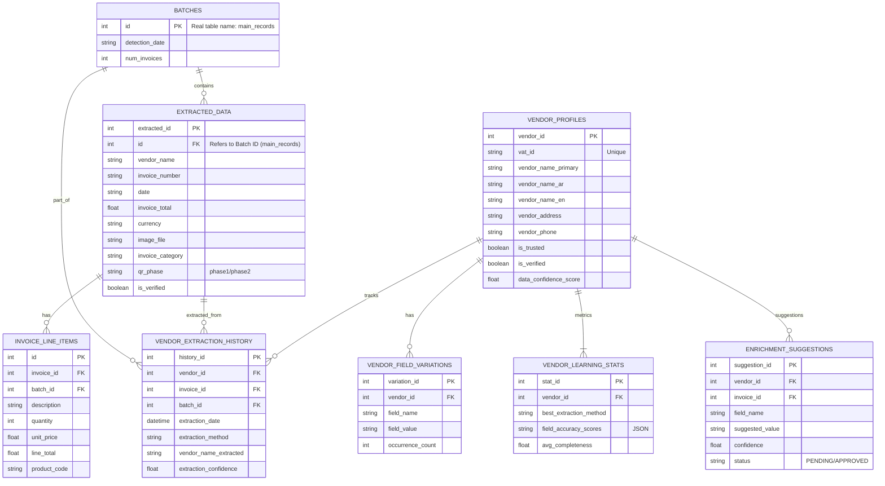

# Invoices Reader - Plugin Developer Manual

> **Complete Reference for Plugin Development**
> This manual provides everything developers (and AI coding assistants) need to build powerful plugins for the Invoices Reader application.

---

## 📌 Application Overview


**Invoices Reader** is a PyQt5 desktop application for OCR-based invoice processing:

- **AI Extraction**: Uses Gemini, OpenRouter, Ollama, LM Studio, and OpenAI-compatible providers to extract invoice data
- **Database**: SQLite (`detections.db`) stores invoices, line items, vendors, batches
- **Queue System**: Global processing queue for async operations
- **Plugin System**: Declarative architecture for safe extensions

### Key Concepts

| Concept             | Description                                             |
| ------------------- | ------------------------------------------------------- |
| **Invoice**   | A document with vendor, date, amounts, line items       |
| **Batch**     | Group of invoices processed together                    |
| **Queue**     | Global list of items being processed                    |
| **Connector** | Background service fetching files from external sources |

---

## 🚀 Quick Start

### Using the Plugin SDK (Recommended)

The Plugin SDK provides everything you need in a single import. It is recommended to use the wildcard import for the best developer experience:

```python
from core.plugins.sdk import *
```

#### What's Included?

The SDK re-exports over 120 common items, including:

- **Standard Library**: `re`, `time`, `urllib`, `os`, `sys`, `shutil`, `json`, `math`, `random`, `uuid`, `tempfile`, `base64`, `threading`, `sqlite3`, `csv`, `io`, `abc`, `asyncio`, `datetime`.
- **Typing**: `List`, `Dict`, `Any`, `Tuple`, `Optional`, `Union`, `Type`, `Generic`, `Literal`, `Final`, etc.
- **Pydantic**: `BaseModel` (aliased as `ConfigModel`), `Field`, `field_validator`.
- **Plugin Framework**: `DeclarativePlugin`, `Action`, `hook`, `get_logger`, `get_api`.
- **UI (PyQt5)**: Common widgets like `QWidget`, `QLabel`, `QPushButton`, `QImage`, `QApplication`.
- **Security**: `sandbox`, `requires_capability`, and capability constants (e.g., `CAPABILITY_UI_TOAST`).

### File Structure

```text
plugins/my_plugin/
├── manifest.json      # Metadata & Permissions (required)
├── main.py            # Plugin class (required)
└── connector.py       # Optional: Background data fetching
```

### Multi-file Plugins (Complex)

If you split your code into multiple files (e.g., `settings.py`), you must structure your plugin as a package:

```text
plugins/complex_plugin/
├── manifest.json      # Set "main": "__init__.py"
├── __init__.py        # Plugin class (ENTRY POINT)
└── settings.py        # Helper module
```

> **Crucial**: You **MUST** use `__init__.py` as the entry point (`"main": "__init__.py"` in manifest) to enable relative imports like `from .settings import Config`.

### Minimal Plugin (using SDK)

```python
# plugins/hello-world/main.py
from core.plugins.sdk import (
    DeclarativePlugin, Action, Field,
    sandbox, get_logger, Dict, Any
)

logger = get_logger(__name__)

class HelloWorldPlugin(DeclarativePlugin):
    """A sample plugin using the SDK"""
  
    # Plugin metadata
    id = "hello-world"
    name = "Hello World"
    version = "2.0.0"
  
    # Declare a field - app creates UI automatically
    notes = Field(
        type="text",
        label="Notes",
        section="Hello World",
        persist=True,
        tooltip="Add your notes here (auto-saved with invoice)"
    )
  
    @Action(label="Greet", icon="👋", location="toolbar", tooltip="Say hello!")
    @sandbox
    def greet(self, invoice: Dict[str, Any]):
        """Called when toolbar button is clicked"""
        vendor = invoice.get('vendor_name', 'Unknown')
        self.api.ui.toast(f"Hello, {vendor}!", "success")
        logger.info(f"Greeted vendor: {vendor}")
```

### manifest.json

```json
{
    "id": "my-plugin",
    "name": "My Plugin",
    "version": "1.0.0",
    "author": "Developer Name",
    "description": "What this plugin does",
    "main": "main.py",
    "plugin_class": "MyPlugin",
    "capabilities": ["ui:toast", "ui:toolbar"],
    "dependencies": []
}
```

### ⚠️ Common Pitfalls (Read this first!)

Before you start, avoid these common mistakes that trip up new developers:

1. **Don't use `Field` for Global Settings**:

   * **Wrong**: Using `Field(persist=True)` for plugin API keys or templates. This saves data *per invoice*.
   * **Right**: Use `QSettings` and `self.api.register_settings_tab` for global configuration (see "Unified Settings" section).
2. **`@Action` Decorator**:

   * **Required**: You MUST provide a `label` argument. `icon` alone is not enough.
   * **Icon Names**: Use `fa5s.name` or `fa5b.name` (brands). Invalid names will be treated as text.
3. **Method Signatures**:

   * `on_load(self) -> bool`: Do NOT accept `api` as an argument. Access it via `self.api`.
   * `action_method(self, invoice=None)`: Action callbacks ALWAYS receive the current `invoice` (dict or None) as the second argument. You MUST add `invoice=None` to your signature to prevent `TypeError`.
4. **API Access**:

   * Use `self.api.get_current_invoice()` to get screen data.
   * Use `self.api.system.open_url(url)` for opening browsers.
   * Use `self.api.ui.toast(msg)` (not `show_toast`).
   * **New**: Error reporting is now automatic. If your action raises an exception, a detailed dialog with traceback will be shown to the user.
5. **Use Relative Imports for Plugin-Internal Modules**:

   * **Wrong**: `from core.plugins.official.my_plugin.helper import Foo` (absolute path)
   * **Right**: `from .helper import Foo` (relative import)
   * **Why**: Plugins are loaded dynamically as source code. Absolute imports to plugin paths may fail in packaged builds because the path structure differs.
   * **Rule**: Use relative imports (`from .module`) for files *inside* your plugin. Use absolute imports (`from core.plugins import`) for the *framework* classes.

---

## 🎨 Declarative Framework

### Plugin Lifecycle

Understanding when your code runs is crucial:

1. **Instantiation**: The `DeclarativePlugin` class is instantiated when the app starts (or during hot-reload).
2. **`on_load()`**: Called immediately after instantiation and API connection.
   * *Usage*: Initialize connects, start schedules, register settings.
   * *Return*: `True` (success) or `False` (failure).
3. **Active State**: The plugin responds to hooks, actions, and API calls.
   * *Note*: The plugin instance persists across invoice navigation. It is **NOT** reloaded when opening a different invoice.
4. **`on_unload()`**: Called when the app closes, the plugin is disabled, or during hot-reload.
   * *Usage*: Cleanup resources, stop threads, close sockets.

### Fields (Auto-Managed UI)

```python
from core.plugins import Field

class MyPlugin(DeclarativePlugin):
    # Creates text input in sidebar, auto-saves with invoice
    notes = Field(type="text", label="Notes", section="My Section", persist=True)
  
    # Other field types
    enabled = Field(type="checkbox", label="Enable Feature")
    priority = Field(type="number", label="Priority", default=1)
```

### Actions (Buttons)

```python
from core.plugins import Action

class MyPlugin(DeclarativePlugin):
    @Action(label="Sync", icon="fa5s.sync", location="toolbar", tooltip="Sync data")
    def sync_now(self, invoice: dict):
        # invoice = current invoice data dict
        self.api.ui.toast("Syncing...")
```

**Location Options:**

- `"toolbar"` - Top toolbar (left side, default)
- `"toolbar:left"` - Explicit left slot
- `"toolbar:right"` - Right slot (near theme toggle)
- `"menu:Tools"` - Add to Tools menu under your plugin name
- `"menu:Plugins"` - Add to Plugins menu (auto-created)
- `"section"` - Inside the plugin's sidebar section. **Note**: If your plugin has no fields, a "Default" section will be created automatically.
- `"actions"` - The "Action Area" next to the main Save/Delete buttons (use sparingly).

**Toolbar Visual Behavior (Current)**

- Toolbar actions created with `@Action(..., location="toolbar")` are rendered as native toolbar `QToolButton` controls so they match built-in toolbar design.
- On smaller screens (width `<= 1366`), toolbar metrics are compacted automatically (smaller icon/button sizing and tighter spacing) so more buttons fit.
- Use valid QtAwesome icon keys (`fa5s.*`, `fa5b.*`) to keep icon style consistent with built-in toolbar actions.

### 🧩 The Invoice Details Panel

This is the main form on the right side of the application where invoice data is displayed. It is the primary place for plugins to show data related to the current invoice.

**Structure:**

1. **Header**: Invoice number and status.
2. **Standard Sections**: "Invoice Details", "Vendor Info", "Payment Info".
3. **Plugin Sections**: Custom collapsible groups added by plugins.

**What you can do here:**

1. **Add Custom Fields**: Use `Field(..., section="My Section")` to add persistent inputs (Text, Checkbox, Number) directly into the form. These auto-save with the invoice.
2. **Add Actions**: Use `@Action(..., location="section")` to add buttons inside your custom section (e.g., "Verify Tax ID").
3. **Add Custom UI**: Use `self.api.ui.add_section()` to add a completely custom widget (graphs, tables, web views) as a collapsible section.

**Example: Custom Section with Fields and Actions**

```python
class MyPlugin(DeclarativePlugin):
    # This creates a new section "Compliance" with two fields
    tax_id = Field(type="text", label="Tax ID", section="Compliance", persist=True)
    verified = Field(type="checkbox", label="Verified", section="Compliance", persist=True)

    @Action(label="Check Online", location="section") # Appears in "Compliance" section
    def check_compliance(self, invoice):
        # Logic to verify tax_id
        pass
```

### 📋 Field Types Reference

The `Field` descriptor supports 10 different widget types:

| Type         | Widget    | Value Type | Description                     |
| ------------ | --------- | ---------- | ------------------------------- |
| `text`     | QLineEdit | str        | Single-line text input          |
| `number`   | QLineEdit | str        | Numeric input with validation   |
| `checkbox` | QCheckBox | bool       | Boolean on/off toggle           |
| `textarea` | QTextEdit | str        | Multi-line text input           |
| `select`   | QComboBox | str        | Dropdown selection list         |
| `spinbox`  | QSpinBox  | int        | Numeric spinner with arrows     |
| `slider`   | QSlider   | int        | Value slider with label         |
| `date`     | QDateEdit | str (ISO)  | Date picker with calendar popup |
| `password` | QLineEdit | str        | Masked text input               |
| `readonly` | QLabel    | str        | Read-only display label         |

**Usage Examples:**

```python
from core.plugins import DeclarativePlugin, Field

class MyPlugin(DeclarativePlugin):
    # Text input
    notes = Field(type="text", label="Notes", section="My Section", persist=True)
  
    # Checkbox
    verified = Field(type="checkbox", label="Verified", section="My Section", persist=True)
  
    # Dropdown with options
    status = Field(type="select", label="Status", section="My Section",
                   options=["Pending", "Approved", "Rejected"])
  
    # Number spinner (0-100)
    confidence = Field(type="spinbox", label="Confidence %", section="My Section",
                       min_val=0, max_val=100)
  
    # Slider (0-10)
    priority = Field(type="slider", label="Priority", section="My Section",
                     min_val=0, max_val=10)
  
    # Date picker
    due_date = Field(type="date", label="Due Date", section="My Section", persist=True)
  
    # Multi-line text
    description = Field(type="textarea", label="Description", section="My Section")
  
    # Password field
    api_key = Field(type="password", label="API Key", section="Settings")
```

**Field Options:**

| Option       | Type  | Default     | Description                    |
| ------------ | ----- | ----------- | ------------------------------ |
| `type`     | str   | `"text"`  | Widget type (see table above)  |
| `label`    | str   | required    | Display label                  |
| `section`  | str   | Plugin name | Panel section to place field   |
| `persist`  | bool  | `False`   | Auto-save with invoice data    |
| `tooltip`  | str   | `""`      | Hover help text                |
| `options`  | list  | `None`    | Options for `select` type    |
| `min_val`  | float | `0`       | Min for `spinbox`/`slider` |
| `max_val`  | float | `100`     | Max for `spinbox`/`slider` |
| `readonly` | bool  | `False`   | Make field read-only           |

**Getting/Setting Values Programmatically:**

```python
# In your hook or action method:
value = self.get_field('notes')           # Returns current value
self.set_field('verified', True)          # Sets checkbox to checked
self.set_field('status', 'Approved')      # Sets dropdown selection
```

### 📄 The Document Viewer

This is the large panel on the left/center of the application that displays the invoice file (PDF or Image).

**Key Features:**

* **Zoom/Pan**: Users can inspect the document details.
* **Highlighting**: The app automatically highlights extracted fields (like Total, Date, Vendor) on the document.

**Plugin Interactions:**

* **Read-Only**: Plugins can read the current file path via `invoice_data['file_path']` in the `invoice.loaded` hook.
* **No Direct Overlays (Yet)**: Currently, plugins cannot draw directly onto the document canvas.
* **Use Cases**: Plugins typically use the file path to:
  * Send the file to an external API.
  * Perform custom OCR/analysis on the raw file.
  * Open the file in an external viewer.

### 💾 Plugin Data Persistence

Beyond the `Field(persist=True)` mechanism (which is per-invoice), you can save arbitrary plugin data linked to the current invoice using `self.api.save_data`.

**Smart Serialization**: You can pass complex Python objects (dictionaries, lists) directly to `save_data`. The API will automatically serialize them to JSON for storage.

```python
# Automatically serialized to JSON
self.api.save_data(self.id, "my_complex_meta", {
    "tags": ["urgent", "utility"],
    "score": 0.95
})

# Retrieve and deserialize automatically
data = self.api.load_data(self.id, "my_complex_meta")
if data:
    print(data["tags"]) # ["urgent", "utility"]
```

---

### Hooks (Events)

```python
class MyPlugin(DeclarativePlugin):
    @hook("invoice.loaded")
    def show_vendor_stats(self, invoice_id: int, invoice: dict):
        """Show stats when invoice is loaded"""
        vendor = invoice.get("vendor_name")
        if not vendor: return
  
        # Query database for past invoices from this vendor
        rows = self.api.db.query(
            "SELECT invoice_total FROM extracted_data WHERE vendor_name = ?", 
            (vendor,)
        )
  
        if rows:
            totals = [float(r[0]) for r in rows if r[0]]
            avg = sum(totals) / len(totals)
            self.api.ui.toast(f"History: {len(rows)} invoices (Avg: {avg:.2f})", "info")
  
    @hook("invoice.saved")
    def on_save(self, invoice_id: int):
        self.api.system.log(f"Invoice {invoice_id} saved", "info")
```

**Available Hooks:**

| Hook                | Arguments                                   | Description                                    |
| ------------------- | ------------------------------------------- | ---------------------------------------------- |
| `invoice.loaded`    | `invoice_id, invoice_data`                  | Invoice displayed                              |
| `invoice.saved`     | `invoice_id`                                | Invoice saved to DB                            |
| `navigation.next`   | (none)                                      | Next invoice button clicked                    |
| `navigation.prev`   | (none)                                      | Previous invoice button clicked                |
| `batch.started`     | `batch_id, count`                           | Batch processing started                       |
| `batch.completed`   | `batch_id, success, errors`                 | Batch processing finished                      |
| `source.processing` | `source, status, metadata, payload`         | Generic source lifecycle event for integrations |

#### Generic Integration Event Pattern (`source.processing`)

Use this event when your plugin needs to react to source-driven flows (WhatsApp, Telegram, watcher imports, etc.) without hardcoding plugin-specific wiring in the host app.

- `source`: integration source identifier (for example: `"whatsapp"`, `"telegram"`, `"watcher"`).
- `status`: lifecycle stage.
- `metadata`: source routing metadata (chat IDs, message keys, sender IDs, etc.).
- `payload`: status-specific data object.

Current statuses emitted by the app:

- `duplicate`: duplicate detected; `payload` contains existing invoice summary.
- `completed`: processing completed; `payload` contains extracted invoice data.
- `failed`: processing failed; `payload` contains at least `error` and `file_path`.

Declarative plugin example:

```python
from core.plugins.sdk import DeclarativePlugin, hook

class SourceAwarePlugin(DeclarativePlugin):
    id = "source-aware"
    name = "Source Aware"

    @hook("source.processing")
    def on_source_processing(self, source, status, metadata, payload):
        if source != "whatsapp":
            return

        data = payload or {}
        if status == "completed":
            inv = data.get("invoice_number", "N/A")
            self.api.ui.toast(f"WhatsApp processed invoice {inv}", "success")
        elif status == "duplicate":
            inv = data.get("invoice_number", "N/A")
            self.api.ui.toast(f"Duplicate invoice detected: {inv}", "warning")
        elif status == "failed":
            err = data.get("error", "Unknown processing error")
            self.api.ui.toast(f"WhatsApp processing failed: {err}", "error")
```

Imperative plugin example:

```python
class MyPlugin(BasePlugin):
    def on_source_processing_event(self, source, status, metadata, payload):
        if source == "telegram" and status == "completed":
            print("Telegram invoice completed", payload)
```

---

## ⚡ API Reference (`self.api`)

### `self.api.ui` - User Interface

#### Allowed UI Components

When creating custom dialogs or docks, you can use standard PyQt5 widgets.

* **Safe**: `QLabel`, `QPushButton`, `QLineEdit`, `QTextEdit`, `QCheckBox`, `QComboBox`, `QTableWidget`, `QProgressBar`.
* **Layouts**: `QVBoxLayout`, `QHBoxLayout`, `QGridLayout`, `QFormLayout`.
* **Avoid**: Top-level `QMainWindow` or `QApplication` instantiation. Always use `QWidget` or `QDialog` with `self.api._main_window` as parent if needed.

#### API Methods

```python
# Toast notifications
self.api.ui.toast("Message", "success")  # Types: info, success, warning, error

# Confirmation dialog
if self.api.ui.show_confirm("Delete?", "Are you sure?"):
    delete_item()

# Text input dialog
name = self.api.ui.show_input("Enter Name", "Vendor name:", "Default")
if name:
    print(f"User entered: {name}")

# Custom dialog with any widget
from PyQt5.QtWidgets import QLabel
widget = QLabel("Custom content here")
if self.api.ui.show_dialog("My Dialog", widget, 400, 300):
    print("User clicked OK")

# Simple modal message (success/error/info)
self.api.ui.message("Title", "Message text here", "success")  # Types: success, error, info, warning

# File browsing (Simplified)
path = self.api.ui.browse_file("Select Invoice", "PDF Files (*.pdf)")
if path:
    print(f"User picked: {path}")

# Directory browsing (Simplified)
folder = self.api.ui.browse_directory("Select Export Folder")
if folder:
    print(f"User picked: {folder}")

# Add menu item
self.api.ui.add_menu_item("Tools", "My Feature", self.my_callback, "fa5s.cog")

# Add unified settings tab (integrates into main settings dialog)
def create_settings_widget():
    widget = QWidget()
    # ... build widget ...
    return widget

self.api.register_settings_tab(self.id, "My Settings", create_settings_widget)

# Add sidebar section (empty, with icon)
section_id = self.api.ui.add_section("My Section", "🔌", plugin_id=self.id)

# Add sidebar section WITH custom widget content
from PyQt5.QtWidgets import QWidget, QVBoxLayout, QLabel
widget = QWidget()
layout = QVBoxLayout(widget)
layout.addWidget(QLabel("Custom analytics here"))
self.api.ui.add_section("Analytics", widget, plugin_id=self.id)

# Add docking window (separate floating panel)
from PyQt5.QtWidgets import QWidget
self.api.ui.add_dock("My Dock", QWidget(), "right")
```

> [!TIP]
> **`add_section` Smart Behavior**:
>
> - **Second argument is polymorphic**: Pass a string for an icon (e.g., `"🔌"`) OR a `QWidget` for custom content.
> - **Custom icon with widget**: Use the `icon` keyword: `add_section("Title", widget, icon="📊", plugin_id=self.id)`
> - **Deduplication**: Calling `add_section` with the same `plugin_id` and `title` reuses the existing section.
> - **Always pass `plugin_id`**: Required for permission checks.

#### 🎨 Icons Reference

**Supported Icon Types:**

| Type                | Example                        | Usage                                         |
| ------------------- | ------------------------------ | --------------------------------------------- |
| **Emoji**     | `"📊"`, `"🔔"`, `"⚙️"` | Works everywhere, simple to use               |
| **QtAwesome** | `"fa5s.chart-bar"`           | FontAwesome 5 Solid icons (for buttons/menus) |

**Using Emojis (Recommended for Sections):**

```python
# Simple emoji icons for sections
self.api.ui.add_section("Analytics", "📊", plugin_id=self.id)
self.api.ui.add_section("Alerts", widget, icon="🔔", plugin_id=self.id)
```

**Common Section Icons:**

| Icon | Meaning          | Icon | Meaning       |
| ---- | ---------------- | ---- | ------------- |
| 📊   | Analytics/Charts | 🔔   | Notifications |
| ⚙️ | Settings         | 📋   | Reports       |
| 🔍   | Search           | 📁   | Files         |
| 💰   | Finance          | 🏢   | Vendor        |
| ⚠️ | Warnings         | ✅   | Success       |

**Finding More Emojis:**

- [Emojipedia](https://emojipedia.org) - Full emoji database
- Windows: `Win + .` (period) to open emoji picker
- Copy-paste directly into your Python code

**Using QtAwesome (For Toolbar/Menu):**

```python
# QtAwesome for toolbar buttons, menu items, and sidebar actions
@Action(label="Sync", icon="fa5s.sync", location="toolbar")
def sync_data(self, invoice):
    pass

# Note: Invalid icon names will fall back to using prefix text.
# Always use valid 'fa5s.*', 'fa5b.*', or 'ei.*' names.
self.api.ui.add_menu_item("Tools", "Settings", callback, "fa5s.cog")

```

**QtAwesome Icon Prefixes:**

| Prefix    | Description          |
| --------- | -------------------- |
| `fa5s.` | FontAwesome 5 Solid  |
| `fa5b.` | FontAwesome 5 Brands |
| `ei.`   | Elusive Icons        |

Browse icons at: [FontAwesome Gallery](https://fontawesome.com/icons)

#### 🪟 Application Windows

Plugins can programmatically open core application dialogs. This is useful for creating "shortcuts" or guiding users to specific settings.

| Method                     | Window / Dialog              | Purpose                                                      |
| :------------------------- | :--------------------------- | :----------------------------------------------------------- |
| `open_history()`         | **History & Database** | Search, filter, and export past invoices.                    |
| `open_settings()`        | **AI Settings**        | Configure Gemini, OpenRouter, Ollama, LM Studio, and OpenAI-compatible providers. |
| `open_integrations()`    | **Integrations**       | Configure ERP connections (Odoo/Wafeq), messaging channels, and webhooks.         |
| `open_processing_mode()` | **Processing Mode**    | Switch between Cloud (AI) and Local (Regex/OCR) modes.       |
| `open_about()`           | **About**              | Version info and credits.                                    |

```python
# Example: Open AI settings from a custom button
@Action(label="Configure AI", location="toolbar")
def configure_ai(self, invoice):
    self.api.ui.open_settings()
```

### `self.api.processing` - AI Extraction

```python
# Synchronous (blocks UI - use in background only)
result = self.api.processing.extract("C:/path/to/invoice.pdf")
if result['success']:
    data = result['data']
    print(f"Vendor: {data['vendor_name']}")
    print(f"Total: {data['invoice_total']}")
    print(f"Items: {len(data.get('line_items', []))}")

# Asynchronous (recommended for UI)
def on_result(result):
    if result['success']:
        self.toast(f"Extracted: {result['data']['invoice_total']}")
    else:
        self.toast(f"Error: {result.get('error_message')}", "error")

self.api.processing.extract_async("invoice.pdf", on_result)
```

> [!TIP]
> If a provider fails during batch processing, the app can prompt the user to switch to another configured provider.
> Keep plugin/connector flows provider-agnostic and let the host app decide failover.

**Extraction Result Structure:**

{
    "success": True,
    "data": {
        "vendor_name": "Acme Corp",
        "invoice_number": "INV-001",
        "invoice_date": "2024-01-15",
        "date": "2024-01-15", // Alias for date
        "invoice_total": 1250.00,
        "currency": "USD",
        "line_items": [
            // Automatically fetched from DB if invoice is saved
            {"description": "Widget", "quantity": 5, "unit_price": 250.00, "line_total": 1250.00}
        ]
    },
    "error_message": None  # or error string if success=False
}

### Saving Extracted Data

After extracting data (especially in Connectors), you **MUST** explicitly save the invoice to the database if you want it to appear in the application history.

```python
# Save extracted data to database
# CRITICAL: Pass db_path if running in a background thread (like connectors)
db_path = context.get('db_path') if 'context' in locals() else None
invoice_id = self.api.processing.save(data, source="my_plugin", db_path=db_path)

if invoice_id:
    print(f"Saved invoice #{invoice_id}")
else:
    print("Failed to save invoice")

### Queue-First Ingestion (Recommended for Connectors/Agents)

For integrations that *receive files* (WhatsApp, Telegram-like connectors, mailbox watchers), prefer queue-first ingestion:

```python
ok = self.api.processing.import_file_to_queue(
    file_path="/absolute/path/to/invoice.pdf",
    source="whatsapp",
    metadata={
        "chat_id": "12345",
        "sender_id": "+9665XXXXXXX",
        "original_filename": "invoice.pdf"
    }
)
```

Why this is recommended:

- Uses the same watcher/background pipeline as the app.
- Preserves duplicate detection and hash tracking.
- Keeps status updates visible in the global queue UI.
- Carries source metadata through processing for source-specific replies.

### `self.api.files` - File Management

High-level helpers for managing physical files related to invoices.

```python
# Move a temporary file to its permanent batch directory and update DB
# This handles folder creation, copy/rename, and updating the image_path in DB.
permanent_path = self.api.files.save_invoice_file(invoice_id, local_temp_path)

if permanent_path:
    self.api.ui.toast(f"File saved to batch folder: {permanent_path}")
```

> [!NOTE]
> `get_current_invoice()` automatically includes `line_items` from the database if the invoice is saved. You do not need to query `invoice_line_items` manually.

### `self.api.queue` - Processing Queue

```python
# Add item to queue
queue_id = self.api.queue.add(
    {"id": 123, "file": "invoice.pdf", "source": "email"},
    source="my_connector"
)

# Update status
self.api.queue.update_status(queue_id, "Downloading")
self.api.queue.update_status(queue_id, "Processing")
self.api.queue.update_status(queue_id, "Success", "Extracted $1,250")

# Get all items
items = self.api.queue.get_all()
for item in items:
    print(f"{item['id']}: {item['status']}")

# Show queue window
self.api.queue.show_window()
```

### `self.api.db` - Database Access

#### Schema Diagram (ERD)



> **Note:**
>
> - `extracted_data.id` is the Foreign Key to `main_records` (Batch).
> - `vendor_profiles` is the central table for Vendor Trust Center data.
> - Tables like `vendor_extraction_history` link extract results to canonical vendor profiles.

> **Note:** In the `extracted_data` table, the column `id` is the Foreign Key linking to the Batch (Table `main_records`). It is NOT called `batch_id`. Be careful when writing SQL queries.

#### Best Practices for Database Access

- **Use `self.api.db.query`**: This method is now backed by a robust, direct connection manager. It is safe to use in plugins and threads.
- **Do NOT use `sqlite3.connect` directly**: Unless absolutely necessary, avoid raw connections to prevent file lock issues.
- **Read-Only by Default**: Most plugin operations should be read-only.

#### API Methods

```python
# Read-only query
results = self.api.db.query(
    "SELECT extracted_id, vendor_name, invoice_total FROM extracted_data WHERE vendor_name LIKE ?",
    ("%Acme%",)
)
for row in results:
    print(f"Invoice {row[0]}: {row[1]} - ${row[2]}")

# Fetch a single value (Convenience)
total_count = self.api.db.get_value("SELECT COUNT(*) FROM extracted_data")
vendor_id = self.api.db.get_value("SELECT vendor_id FROM vendor_profiles WHERE vat_id = ?", (vat_id,))

# Write operation (requires data:write capability)
success = self.api.db.execute(
    "UPDATE extracted_data SET notes = ? WHERE extracted_id = ?",
    ("Updated via plugin", invoice_id)
)
```

### `self.api.system` - System Utilities

```python
# Logging
self.api.system.log("Something happened", "info")  # Levels: debug, info, warning, error

# Schedule recurring task (every 60 seconds)
task_id = self.api.system.schedule(self.check_updates, 60)

# Cancel scheduled task
self.api.system.cancel_schedule(task_id)

# Get app info
info = self.api.system.get_app_info()
print(info['plugin_dir'])  # Path to plugins folder

# Get current invoice
invoice = self.api.get_current_invoice()
if invoice:
    print(f"Current: {invoice.get('vendor_name')}")
    print(f"Batch ID: {invoice.get('batch_id')}")
    print(f"File: {invoice.get('file_path')}")

# Open URL in default browser
self.api.system.open_url("https://google.com")
```

### `self.api.get_plugin_api()` - Plugin Communication

```python
# In Plugin A - expose functions
class PluginA(DeclarativePlugin):
    @property
    def exports(self):
        return {
            'send_alert': self._send_alert,
            'get_status': lambda: self._status
        }
  
    def _send_alert(self, message: str):
        # Do something
        pass

# In Plugin B - call Plugin A
telegram = self.api.get_plugin_api('telegram_declarative')
if telegram and 'send_message' in telegram:
    telegram['send_message']("Invoice processed!")
```

---

### `self.api.register_settings_tab` - Unified Settings

The `register_settings_tab` method allows you to add a native page to the application's **Unified Settings Dialog**. This is preferred over creating custom dialogs for configuration.

```python
def on_load(self):
    # Register a tab in the "Integrations" section (or dynamic list)
    if hasattr(self.api, 'register_settings_tab'):
        self.api.register_settings_tab(
            plugin_id=self.id,
            label="My Plugin", 
            widget_factory=self._create_settings_ui
        )
    return True

def _create_settings_ui(self):
    # Use SchemaWidget for auto-generated forms from Pydantic models
    from core.plugins.schema_ui import SchemaWidget
    from pydantic import BaseModel
  
    class Config(BaseModel):
        api_key: str
        enabled: bool = True

    return SchemaWidget(Config, initial_data=self.config, on_save=self.save_config)
```

---

## 🔌 Declarative Connector Framework

For plugins that fetch data from external sources (like Telegram, Email, Drives), use the **Declarative Connector Framework**. This provides a robust, threaded, and standardized way to build integrations.

### 1. Define Configuration Schema

Define your configuration using Pydantic. This is used to auto-generate the settings UI.

```python
from pydantic import BaseModel, Field

class MyConfig(BaseModel):
    api_key: str = Field(..., title="API Key", json_schema_extra={"password": True})
    poll_interval: int = Field(60, title="Poll Interval (s)", ge=10)
```

### 2. Create Connector Class

Inherit from `DeclarativeConnector` and define your triggers.

```python
from core.plugins.connector import DeclarativeConnector
from core.plugins.triggers import PollingTrigger, APIKeyAuth

class MyConnector(DeclarativeConnector):
    display_name = "My Service"
    config_model = MyConfig
  
    # Auto-manages auth validation
    auth = APIKeyAuth(field="api_key")
  
    # Define triggers (polling, webhook, etc)
    triggers = [
        PollingTrigger(
            interval_field="poll_interval",
            method="fetch_items"
        )
    ]

    def connect(self, config: MyConfig):
        # Validate connection and return client
        client = MyClient(config.api_key)
        if not client.ping():
            raise ConnectionError("Failed to connect")
        return client

    def fetch_items(self, client, config: MyConfig, last_state: dict) -> tuple[list, dict]:
        # Called periodically based on poll_interval
        last_id = last_state.get('last_id', 0)
        new_items = client.get_updates(since=last_id)
  
        results = []
        max_id = last_id
  
        for item in new_items:
            results.append({
                'id': item.id,
                'file_path': item.download_url, # Worker will download this
                'source': 'my_service',
                'original_filename': item.filename
            })
            max_id = max(max_id, item.id)
      
        return results, {'last_id': max_id}
        return results, {'last_id': max_id}

    @sandbox
    def process_item(self, item: dict, context: dict) -> dict:
        """
        Process a single item (download, extract, SAVE).
    
        CRITICAL: You must explicitly save the invoice after extraction!
        """
        api = context.get('api')
        update_status = context.get('update_status')
    
        # 1. Download file
        update_status("Downloading", "Fetching file...")
        local_path = self._download_file(item['file_path'])
    
        # 2. Extract Data
        update_status("Processing", " extracting data...")
        result = api.processing.extract(local_path)
    
        if result['success']:
             data = result['data']
         
             # 3. SAVE TO DATABASE (Important!)
             # Retrieve db_path from context to ensure thread-safe connection
             db_path = context.get('db_path')
             saved_id = api.processing.save(data, source="my_connector", db_path=db_path)
         
             update_status("Success", f"Saved invoice #{saved_id}")
             return {"status": "Success", "data": data}
        else:
             update_status("Error", result['error_message'])
             return {"status": "Error", "message": result['error_message']}

    def _download_file(self, url):
        # Implementation details...
        return "/tmp/invoice.pdf"
```

### 3. Integrate in Main Plugin

Use the `GenericConnectorWorker` to manage the lifecycle.

```python
from core.plugins.connector_worker import GenericConnectorWorker

class MyPlugin(DeclarativePlugin):
    def on_load(self):
        self.config = self._load_config() # Load your MyConfig model
        self.connector = MyConnector()
  
        # Start worker thread
        self.worker = GenericConnectorWorker(self.connector, self.config, db_path="...", api=self.api)
        self.worker.start()
  
    def on_unload(self):
        if self.worker:
            self.worker.stop()
```

---

## ⭐ Best Practices

1. **Always use Async for Heavy Tasks**:

   * ❌ BLOCKING: `time.sleep(5)` or `requests.get()` in the main thread. Freezes the UI.
   * ✅ ASYNC: Use `self.api.processing.extract_async()` or run code in a separate thread.
2. **Protect Risky Code with `@sandbox`**:

   * Wrap entry points (actions, hooks) with `@sandbox` so one error doesn't crash the whole app.
3. **UI Type Safety**:

   * Always use `from core.plugins.sdk import *` for type safety and access to all protocols.
   * Use `InvoiceData`, `QueueItem`, etc., for proper type hinting.
4. **Resource Cleanup**:

   * Always implement `on_unload()` to stop timers, close files, and disconnect signals.
5. **Use Capabilities Explicitly**:

   * Don't just add all capabilities. Follow "Least Privilege".
   * Use `@requires_capability` decorator to enforce checks.
6. **Database Efficiency**:

   * Use parameterized queries `sql = "SELECT * FROM x WHERE id=?"` and `params=(1,)`.
   * Never concatenate strings into SQL (SQL Injection risk).

---

## 🛡️ Permissions & Capabilities

Define in `manifest.json` to unlock API features:

```json
{
    "capabilities": [
        "ui:toast",  
        "ui:toolbar",  
        "ui:section",  
        "ui:section",  
        "ui:settings",
        "data:read",   
        "data:write",  
        "data:persist",  
        "network:access",  
        "file:read",   
        "file:write",  
        "integration:source",
        "integration:mode",
        "plugin:communicate"
    ]
}

### Permission Popup & Dynamic Access
If a plugin requests a capability not listed in its `manifest.json`, the application will **pause and prompt the user** to allow or deny the request. 

*   **Denied**: The API call returns `None` or raises `PermissionDeniedError`, and the plugin logic should handle the failure gracefully.
*   **Allowed**: The capability is granted for the current session.

> [!WARNING]
> While dynamic requests are possible, strictly declaring capabilities in `manifest.json` is best practice to build user trust.

### Enforcing Permissions
```python
from core.plugins.permissions import requires_capability, sandbox

class MyPlugin(DeclarativePlugin):
    @requires_capability("network:access")
    def fetch_external_data(self):
        # Only runs if plugin has network:access
        pass
  
    @sandbox
    def risky_operation(self):
        # Errors here won't crash the app
        pass
```

---

## 📦 Dependencies

Declare Python packages in `manifest.json`:

```json
{
    "dependencies": ["requests>=2.28", "pandas"]
}
```

### 1. Standard Library

All standard Python 3.12 libraries are available.

### 2. Application Packages

The following packages are pre-installed in the application environment:

* `requests`
* `pydantic`
* `PyQt5`
* `sqlite3`

### 3. Bundling External Dependencies (Vendoring)

Since the application is distributed as a frozen executable (using Nuitka), users cannot simply `pip install` packages into it. If your plugin requires external libraries (e.g., `pandas`, `beautifulsoup4`, `pymongo`), you must **bundle** them with your plugin.

**How to Bundle Libraries:**

1. Create a folder named `libs` inside your plugin directory.
2. Install the package *into* that folder using pip's `--target` option.

```bash
# In your terminal
cd plugins/my-plugin
mkdir libs
pip install pandas --target=./libs
```

**Structure:**

```text
plugins/my-plugin/
├── main.py
├── manifest.json
└── libs/
    ├── pandas/
    ├── numpy/
    └── ...
```

**Usage:**

Just `import` normally in your code. The Plugin Loader automatically adds the `libs` folder to the system path.

```python
# main.py
import pandas as pd  # Works automatically!

class MyPlugin(DeclarativePlugin):
    ...
```

> [!IMPORTANT]
> **Binary Dependencies**: Pure Python packages work best. Packages with compiled C extensions (like `numpy`, `pillow`) *may* work if you bundle the correct binary wheels for Windows, but can be tricky. Test thoroughly.

---

---

## 🔥 Development Tools

### Hot Reload

```bash
set INVOICES_DEV_MODE=1
python main.py
```

Plugins auto-reload on file save.

### Plugin Inspector

**Tools → Plugin Inspector** shows:

- Loaded plugins
- Fields, actions, hooks
- Signal connections

### Type Hints

```python
from core.plugins.types import InvoiceData, ExtractionResult, InvoicesAPIProtocol

class MyPlugin(DeclarativePlugin):
    api: InvoicesAPIProtocol  # Full IDE autocomplete
```

---

## 🎯 Common Patterns

### Send Notification on Save

```python
@hook("invoice.saved")
def notify_on_save(self, invoice_id):
    invoice = self.api.db.query("SELECT vendor_name, invoice_total FROM extracted_data WHERE extracted_id=?", (invoice_id,))
    if invoice:
        self.toast(f"Saved: {invoice[0][0]} - ${invoice[0][1]}")
```

### Background Sync

```python
def on_load(self):
    self._sync_task = self.api.system.schedule(self.sync, 300)  # Every 5 min

def on_unload(self):
    self.api.system.cancel_schedule(self._sync_task)

def sync(self):
    # Sync logic here
    self.api.system.log("Syncing...", "info")
```

### Export to External Service

```python
@Action(label="Export", icon="fa5s.upload", location="toolbar")
def export_invoice(self, invoice):
    if self.api.ui.show_confirm("Export?", f"Send {invoice['vendor_name']} to CRM?"):
        # Call external API
        self.toast("Exported!", "success")
```

---

## 📋 Checklist for New Plugins

- [ ] Create folder: `plugins/my-plugin/`
- [ ] Create `manifest.json` with id, name, version, capabilities
- [ ] Create `main.py` with class inheriting `DeclarativePlugin`
- [ ] Set `id`, `name`, `version` class attributes
- [ ] Implement `on_load()` for initialization
- [ ] Implement `on_unload()` for cleanup
- [ ] Add `@Action` for buttons
- [ ] Add `@hook` for event handling
- [ ] Add `Field` for persistent data
- [ ] Test with Plugin Inspector

---

## 🆘 Troubleshooting

| Issue                | Solution                                                        |
| -------------------- | --------------------------------------------------------------- |
| Plugin not loading   | Check `manifest.json` syntax, verify `plugin_class` matches |
| Action not appearing | Verify `location` is valid, check capabilities                |
| Hook not firing      | Verify hook name spelling, check signal connection in Inspector |
| Permission denied    | Add required capability to manifest                             |
| Import error         | Add package to `dependencies` in manifest                     |

---

*Last updated: December 2024*

---

## 📂 Plugin Templates

### Template 1: Export to CSV (using SDK)

Exports the current invoice details to a CSV file.

```python
from core.plugins.sdk import *

class ExportPlugin(DeclarativePlugin):
    id = "csv-exporter"
    name = "Smart Exporter"
    version = "2.0.0"
  
    @Action(label='Export CSV', icon='fa5s.file-csv', location='menu:Plugins')
    @sandbox
    @requires_capability('file:write')
    def export_csv(self, invoice: Dict[str, Any]):
        """Export all invoices from current batch to CSV."""
        try:
            # 1. Get data (from batch or current invoice)
            batch_id = invoice.get('batch_id')
            if not batch_id:
                self.api.ui.toast("No batch context", "warning")
                return

            rows = self.api.db.query(
                "SELECT extracted_id, vendor_name, invoice_total, date, currency FROM extracted_data WHERE id = ?",
                (batch_id,)
            )
    
            if not rows:
                self.api.ui.toast('No invoices to export', 'warning')
                return
    
            # 2. Determine path
            filename = f"export_{datetime.now().strftime('%Y%m%d_%H%M%S')}.csv"
            export_dir = os.path.expanduser('~/Desktop')
            filepath = os.path.join(export_dir, filename)
    
            # 3. Write file
            with open(filepath, 'w', newline='', encoding='utf-8-sig') as f:
                writer = csv.writer(f)
                writer.writerow(['ID', 'Vendor', 'Total', 'Date', 'Currency']) # Header
                writer.writerows(rows)
    
            self.api.ui.message(
                "Export Complete",
                f"✅ Exported {len(rows)} invoices to:\n{filepath}",
                "success"
            )
        except Exception as e:
            self.api.system.log(f"Export failed: {e}", 'error')
            self.api.ui.toast("Export failed", "error")
```

### Template 2: Auto-Tag Vendor

Automatically adds a tag to the vendor profile when an invoice is saved.

```python
from core.plugins import DeclarativePlugin, hook, requires_capability

class AutoTagger(DeclarativePlugin):
    id = "auto-tagger"
    name = "Auto Tagger"
    version = "1.0.0"

    @hook("invoice.saved")
    @requires_capability("data:write")
    def on_save(self, invoice_id):
        # Get invoice data
        res = self.api.db.query("SELECT vendor_name, invoice_total FROM extracted_data WHERE extracted_id=?", (invoice_id,))
        if not res: return
  
        vendor_name, total = res[0]
  
        # Logic: Tag high-value vendors
        if total > 5000:
            self.api.system.log(f"Tagging high-value vendor: {vendor_name}")
            # (Assume vendor_trust_scores table exists)
            self.api.db.execute(
                "UPDATE vendor_trust_scores SET vendor_tags = 'VIP' WHERE vendor_name = ?", 
                (vendor_name,)
            )
            self.api.ui.toast(f"Marked {vendor_name} as VIP", "info")
```

### Template 3: Declarative Fields + Custom Widget

Combines auto-managed fields with a custom widget in the same section.

```python
from PyQt5.QtWidgets import QWidget, QVBoxLayout, QLabel
from core.plugins import DeclarativePlugin, hook, Field

class VendorAnalytics(DeclarativePlugin):
    id = "vendor-analytics"
    name = "Vendor Analytics"
    version = "1.0.0"
  
    # Declarative field - creates "Analytics" section automatically
    show_charts = Field(type="checkbox", label="Show Charts", section="Analytics", persist=True)

    def on_load(self):
        # Custom widget for dynamic content
        self.summary_widget = QWidget()
        layout = QVBoxLayout(self.summary_widget)
        self.lbl_summary = QLabel("Loading...")
        layout.addWidget(self.lbl_summary)
  
        # Add widget to the SAME section created by Field above
        # Deduplication ensures no duplicate sections
        self.api.ui.add_section("Analytics", self.summary_widget, plugin_id=self.id)
        return True
  
    @hook("invoice.loaded")
    def on_invoice_loaded(self, invoice_id, invoice):
        vendor = invoice.get("vendor_name", "Unknown")
        self.lbl_summary.setText(f"<b>Vendor:</b> {vendor}")
```

### Template 4: Complete UI Test (Cookbook)

A comprehensive plugin demonstrating **every supported UI location** and correct icon usage.

**manifest.json**

```json
{
    "id": "ui-location-test",
    "name": "UI Location Test",
    "version": "1.0.0",
    "author": "Antigravity",
    "description": "Demonstrates all UI action locations",
    "main": "main.py",
    "plugin_class": "UiTestPlugin",
    "capabilities": ["ui:section", "ui:toolbar", "ui:toast"]
}
```

**main.py**

```python
from core.plugins.sdk import *

class UiTestPlugin(DeclarativePlugin):
    id = "ui-location-test"
    name = "UI Location Test"
  
    def on_load(self) -> bool:
        return True

    # 1. Sidebar Section (Default or Custom)
    @Action(label="Sidebar Button", icon="fa5s.plug", location="section")
    def test_section(self, invoice=None):
        self.api.show_toast("Clicked Sidebar Action!", "info")

    # 2. Main Toolbar (Left Slot)
    @Action(label="Left", icon="fa5s.arrow-left", location="toolbar:left")
    def test_toolbar_left(self, invoice=None):
        self.api.show_toast("Clicked Toolbar Left!", "info")

    # 3. Main Toolbar (Right Slot)
    @Action(label="Right", icon="fa5s.arrow-right", location="toolbar:right")
    def test_toolbar_right(self, invoice=None):
        self.api.show_toast("Clicked Toolbar Right!", "info")

    # 4. Plugins Menu
    @Action(label="Test Action (Plugins)", icon="fa5s.puzzle-piece", location="menu:Plugins")
    def test_menu_plugins(self, invoice=None):
        self.api.show_toast("Clicked Plugins Menu Action!", "info")

    # 5. Tools Menu
    @Action(label="Test Action (Tools)", icon="fa5s.tools", location="menu:Tools")
    def test_menu_tools(self, invoice=None):
        self.api.show_toast("Clicked Tools Menu Action!", "info")

    # 6. Action Area (Process Buttons)
    @Action(label="Action Area", icon="fa5s.bolt", location="actions")
    def test_actions_area(self, invoice=None):
        self.api.show_toast("Clicked Action Area Button!", "info")
```
